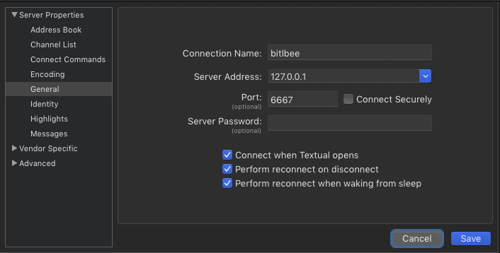
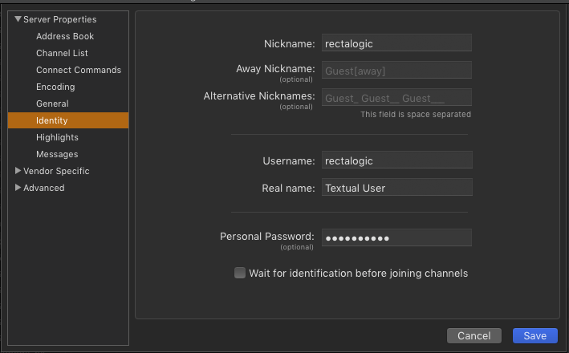

BitlBee Docker
==============

Experiment to run [BitlBee](https://www.bitlbee.org/) in a [Docker](https://www.docker.com/products/docker-desktop) container with [Textual](https://www.codeux.com/textual/) IRC client on macOS.

Configuring Textual
-------------------
With Docker running, run `bitlbee.sh`. This will create `~/.bitlbee` which will hold your configuration files.

In Textual `Server > Add Server...` and configure the BitlBee server:



Connect to the server, then in the new Textual `&bitlbee` channel register a password with BitlBee: <code>register <i>YOUR_PASSWORD</i></code>

Configure Textual to identify with that password on connection:



Configuring BitlBee
-------------------

Generate a Slack [legacy API token](https://api.slack.com/custom-integrations/legacy-tokens).

In the `&bitlbee` channel in Textual, add a Slack account using your Slack identity and token:

<pre>
account add slack <i>username</i>@<i>networkname</i>.slack.com
account slack set api_token xoxp-<i>YOUR_TOKEN_VALUE</i>
account slack on
</pre>

Then for each slack channel you want to mirror in Textual, add the channel and set it to auto join:

```
chat add slack general
channel general set auto_join true
/join #general
```

Rebuild Container
-----------------

```sh-session
$ docker build --pull --tag rectalogic/bitlbee:latest docker
$ docker push rectalogic/bitlbee:latest
```